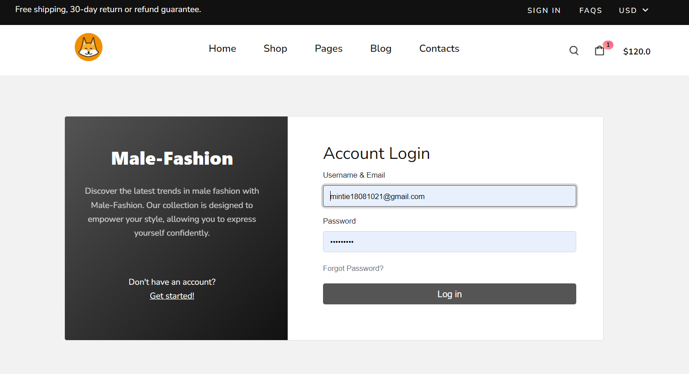
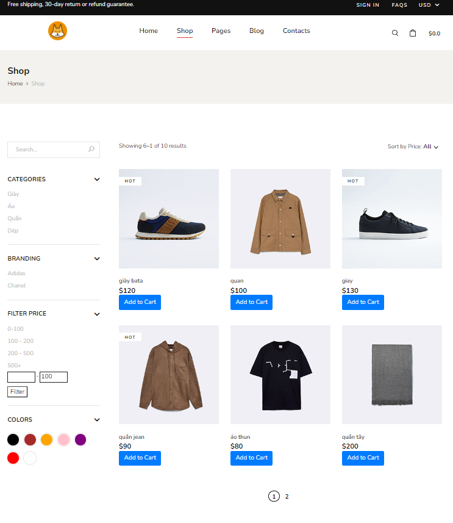
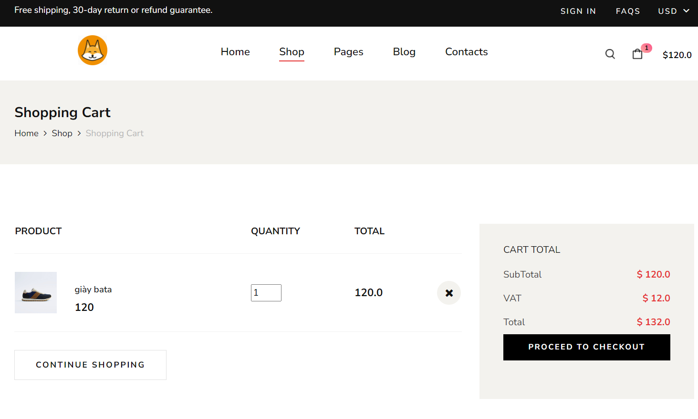
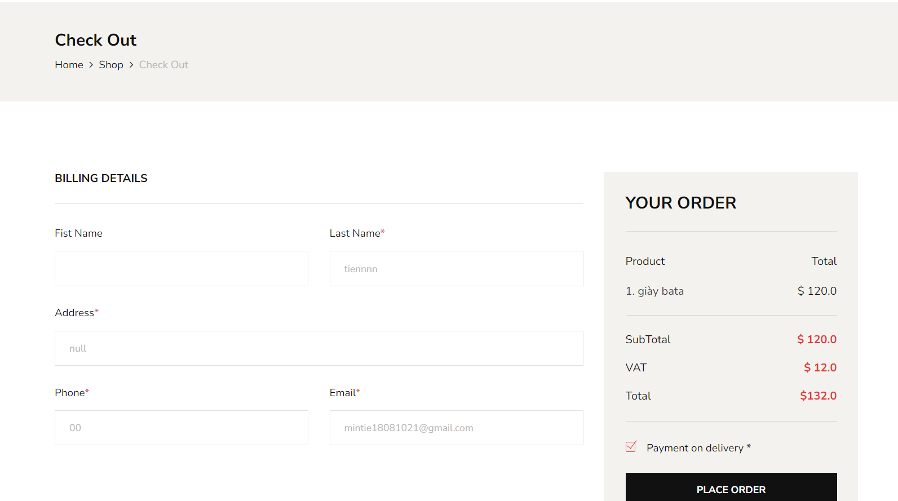
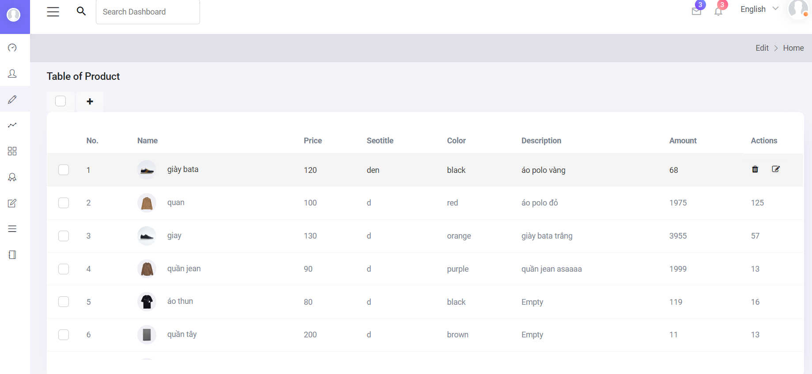
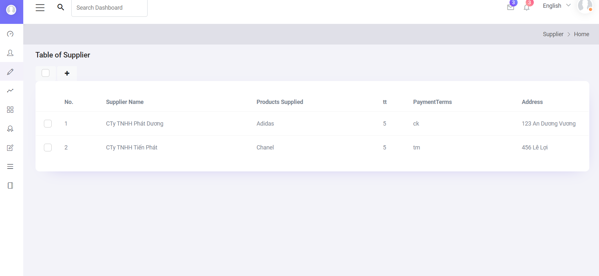

# Shop Shoe Online : Advance Java WebProject
Shop Shoe Online is an Advance Java Web Project. 

# Technology used in this project: 
Advance JAVA concepts like JSP, JSTL, Servlet, Hibernate ,HTML, CSS, Boostrap 5, Fontawesome and SQl Server Management Studio

# Project View: 
Some Screenshots of this project are given below 

# Home Page:

# Login:

# Edit Profile:

# Shop:

# Detail Product:

# Cart:

# Checkout:

# Admin Product:

# Admin Supplier:

# Have a nice day 

# Thank you for visiting my profile.

